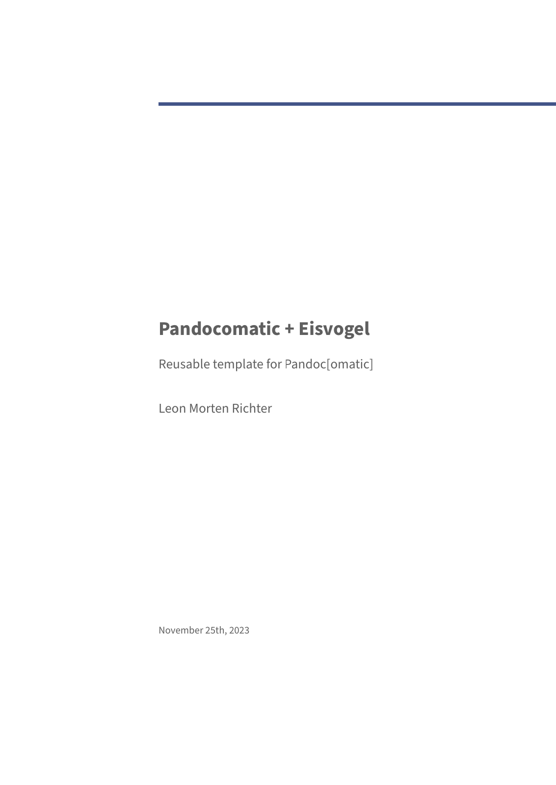
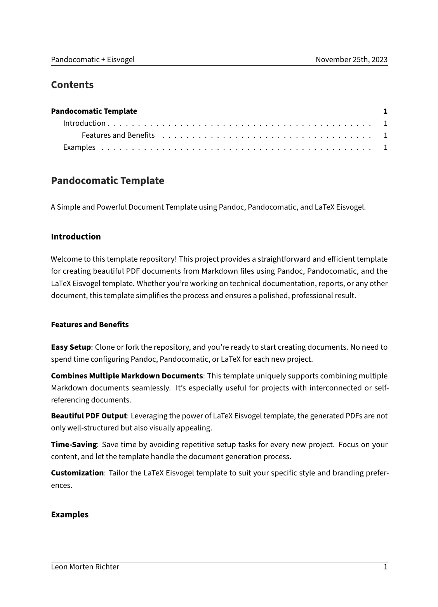
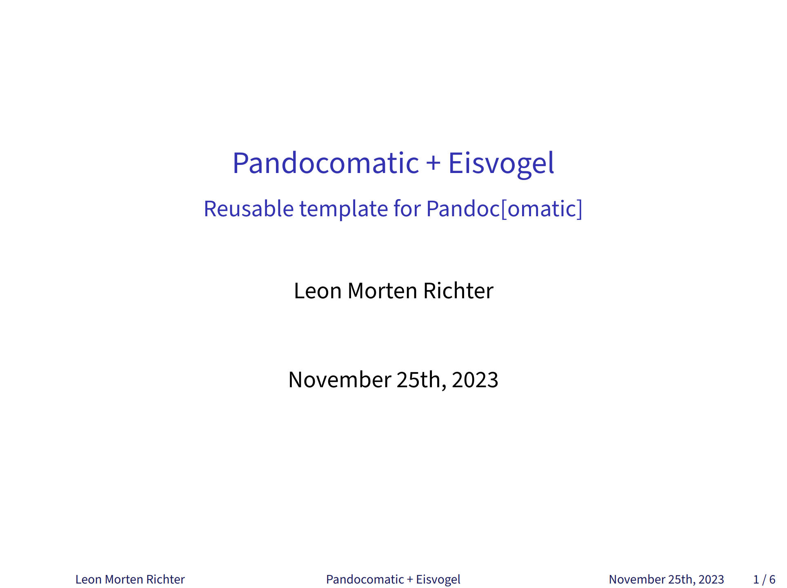
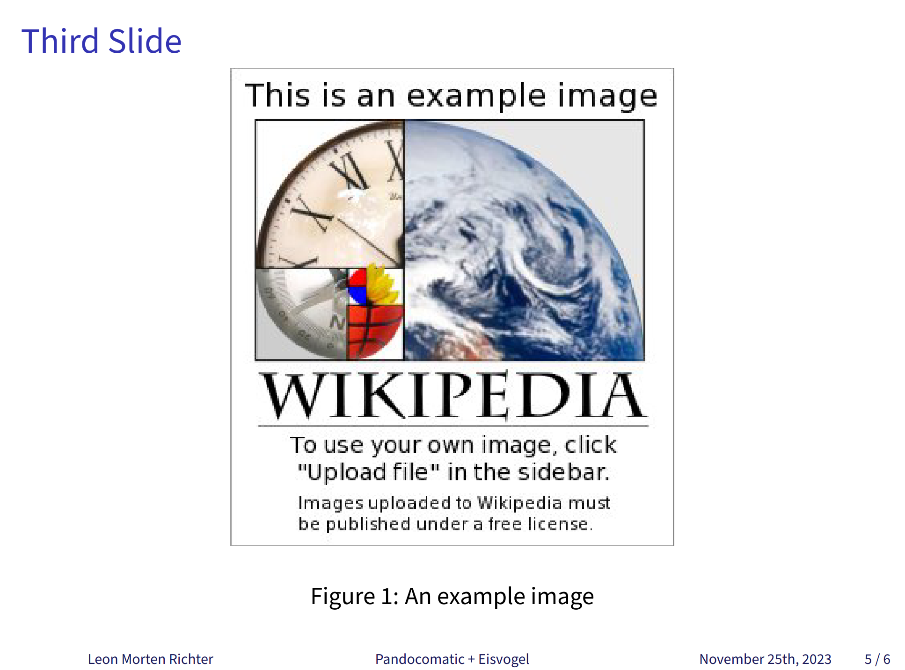

# Pandoc, Pandocomatic, and the LaTeX Eisvogel template

Welcome to this template repository! This project provides a straightforward and efficient template for creating beautiful PDF documents from Markdown files using Pandoc, Pandocomatic, and the LaTeX Eisvogel template. Whether you're working on technical documentation, reports, or any other document, this template simplifies the process and ensures a polished, professional result.

## Credit

- [Pandoc](https://github.com/jgm/pandoc)
- [Pandocomatic](https://github.com/htdebeer/pandocomatic)
- [Eisvogel](https://github.com/Wandmalfarbe/pandoc-latex-template)

## Features and Benefits

**Easy Setup**: Clone or fork the repository, and you're ready to start creating documents. No need to spend time configuring Pandoc, Pandocomatic, or LaTeX for each new project.

**Combines Multiple Markdown Documents**: This template uniquely supports combining multiple Markdown documents seamlessly. It's especially useful for projects with interconnected or self-referencing documents.

**Beautiful PDF Output**: Leveraging the power of LaTeX Eisvogel template, the generated PDFs are not only well-structured but also visually appealing.

**Time-Saving**: Save time by avoiding repetitive setup tasks for every new project. Focus on your content, and let the template handle the document generation process.

**Customization**: Tailor the LaTeX Eisvogel template to suit your specific style and branding preferences.

## Pictures






## Installation

Follow these simple steps to set up the document template:

Clone the Repository:

```bash
git clone https://github.com/M0r13n/pandocomatic-eisvogel-template
cd pandocomatic-eisvogel-template
```

Place your Markdown files in the **doc/** folder. You can create a hierarchy and reference other files as needed (use `::paru::insert file-name.md` to insert files).

Install the required packages. You might need to adjust the `Makefile`, as it is currently written for Ubuntu:


```bash
make install
```

Run the following command to generate the PDF document:

```bash
make
```

Find your compiled PDF in the **build/** directory. The file is named **result.pdf**.

Feel free to explore and customize the template to meet your specific requirements.

## Slides

There is also a minimalistic presentation template in the [slides](./slides) folder. This is a modified version of the [default slide show](https://pandoc.org/chunkedhtml-demo/10-slide-shows.html) from Pandoc.



