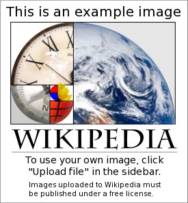

# My awesome presentation

## First Slide

- Foo is bar
- Bar Bar Bar
- Baz Baz Baz

## Second Slide

```python
def greet():
    print('Hello, World!')

if __name__ == '__main__':
    greet()
```

## Third Slide

{ height=256px }

## Fourth Slide

\begin{center}
Thank you!
\end{center}
